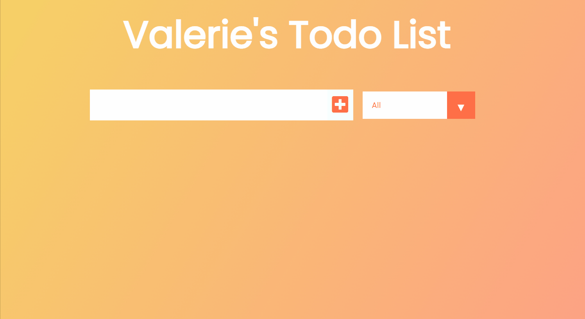

# To Do List App

### This project is a deployed ReactJS To Do List App.

## [Visit my App to make your own to-do list here](https://valerienierenberg.github.io/todo_app_react/).

#### Users can:
- Add items to their to-do list
- Mark items as completed or uncompleted (with corresponding UI elements)
- Remove items from their to-do list
- Filter which items are shown on the list - filter options:
    - All
    - Completed
    - Uncompleted

#### Made with:
- React JS
- Javascript
- HTML
- CSS

#### What I've learned:
- Saving states (React's useState) and using that state to display desired UI content
- Running functions as and when desired (React's useEffect)
- Components
- Props
- Preventing default behaviors
- This was my first complete React JS app, and I have certainly learned a lot :)

### Demo of my To Do App!

#### Special Thanks [Dev Ed](https://www.youtube.com/channel/UClb90NQQcskPUGDIXsQEz5Q)
